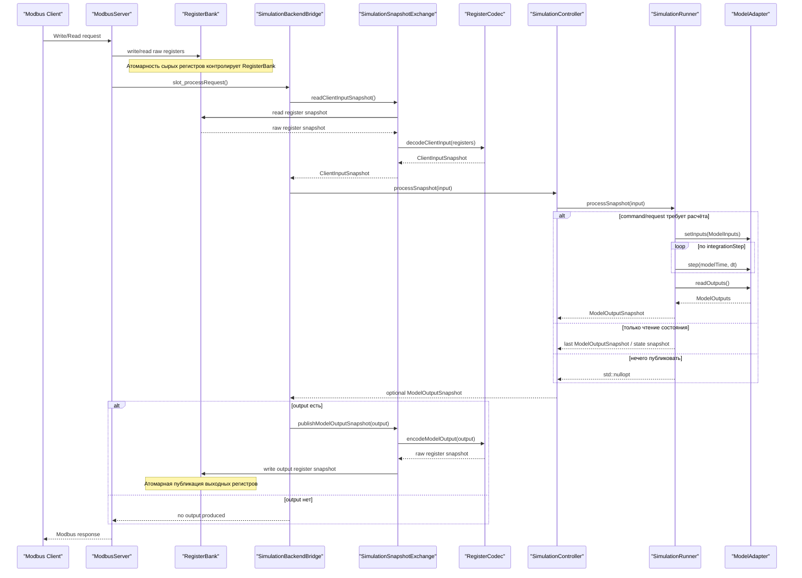

# Архитектура проекта `aris-engine-emulator`

## 1. Назначение документа

Документ описывает архитектуру модуля моделирования стенда обкатки дизельного двигателя.

Модуль моделирования предоставляет ядру SCADA доступ к имитационной модели через Modbus-интерфейс. В рамках Modbus-взаимодействия модуль моделирования выступает в роли сервера, а ядро SCADA — в роли клиента.

Модуль моделирования включает:

- Modbus-сервер;
- контроллер моделирования;
- адаптер FMU/FMI;
- карту Modbus-регистров;
- механизм преобразования Modbus-команд во входы модели;
- механизм преобразования выходов FMU в Modbus-регистры;
- диагностику состояния модели.

## 2. Контекст модуля

Модуль моделирования является частью системы автоматизации процесса обкатки дизельных двигателей (далее — Система).

На уровне всей Системы выделяются следующие крупные части, реализуемые отдельными командами разработки:

1. тестовый модуль моделирования, описываемый в данном документе.
2. backend SCADA;
3. frontend SCADA.

Модуль моделирования не реализует пользовательский интерфейс, хранение истории испытаний и формирование отчётов. Эти функции относятся к backend/frontend-части Системы.

**Основная задача модуля** — предоставлять backend'у SCADA реалистичные моделируемые данные датчиков и принимать управляющие воздействия на моделируемые исполнительные механизмы.

## 3. Границы ответственности

**Модуль моделирования отвечает за:**

- Modbus-серверную часть:
    - запуск Modbus TCP-сервера;
    - приём команд от клиента, то есть backend'а SCADA;
    - хранение актуального состояния Modbus-регистров;
    - обработку записи управляющих регистров;
    - публикацию телеметрии модели через Modbus-регистры;
    - публикацию статуса модели через Modbus-регистры;
    - публикацию диагностических кодов через Modbus-регистры (?);

- контроллер моделирования:
    - преобразование команд Modbus в управляющие воздействия модели;
    - преобразование уставок из Modbus-регистров во входные параметры модели;
    - запуск, управление состояниями и останов моделирования по команде ядра SCADA;
    - синхронизацию цикла обмена между Modbus-регистрами и FMU;

- FMU-runtime / FMI-adapter:
    - загрузку FMU;
    - чтение описания модели из `modelDescription.xml`;
    - загрузку бинарной библиотеки FMU;
    - связывание с FMI-функциями;
    - создание экземпляра FMU;
    - инициализацию FMU через FMI API;
    - установку входных переменных FMU через FMI API;
    - выполнение шага моделирования через FMI API;
    - чтение выходных переменных FMU через FMI API;
    - обработку статусов, возвращаемых FMI API;
    - преобразование FMI-ошибок в диагностические коды модуля;
    - завершение работы FMU и освобождение ресурсов.


## 4. Внешнее взаимодействие с яром SCADA

Взаимодействие между ядром SCADA и модулем моделирования выполняется по протоколу [Modbus](https://ru.wikipedia.org/wiki/Modbus).

Архитектурные роли:

| Участник | Роль Modbus | Ответственность |
|---|---|---|
| Backend SCADA | Client | Читает и записывает регистры модуля моделирования |
| Модуль моделирования | Server | Хранит регистры, принимает команды, публикует телеметрию |

Основные положения:

- Backend SCADA инициирует все операции обмена. 
- Модуль моделирования не выполняет активную отправку данных в ядро SCADA. 
- Передача данных осуществляется через чтение и запись Modbus-регистров.

## 5. Общая архитектура модуля

Основной принцип архитектуры:

- Backend SCADA не знает о FMI.
- Backend SCADA работает только с Modbus-регистрами.
- Модуль моделирования выступает в роли `Modbus TCP Server`.
- Backend SCADA выступает в роли `Modbus TCP Client`.
- В первой итерации слой моделирования работает через универсальный `ModelAdapter`, без прямой зависимости от FMI/FMU.
- Будущий `FmiModelAdapter` должен быть одной из реализаций `ModelAdapter`.
- Соответствие между Modbus-регистрами и внутренними структурами данных выполняется через `RegisterCodec`.
- Передача данных между Modbus-слоем и слоем моделирования выполняется только атомарными снимками.

Линейная схема слоёв:

```text
Backend SCADA
    ↓ Modbus TCP
Modbus layer
    ↓
RegisterBank layer
    ↓
SnapshotExchange boundary
    ↓
SimulationController layer
    ↓
ModelAdapter layer
    ↓
SimulationModel layer
```

Схема слоёв и пакетов:

```mermaid
flowchart LR
    Backend["Backend SCADA<br/>Modbus Client"]

    subgraph ModbusLayer["Modbus layer"]
        ModbusServer["ModbusServer<br/>QModbusTcpServer"]
    end

    subgraph RegisterLayer["RegisterBank layer"]
        RegisterBank["RegisterBank<br/>raw register storage, atomic read/write"]
        RegisterCodec["RegisterCodec<br/>registers -> DTO"]
    end

    subgraph SnapshotBoundary["SnapshotExchange boundary"]
        SnapshotExchange["SimulationSnapshotExchange"]
        BackendBridge["SimulationBackendBridge"]
    end

    subgraph SimulationLayer["SimulationController layer"]
        SimulationController["SimulationController<br/>public snapshot API"]
        SimulationRunner["SimulationRunner<br/>strategy interface"]
        StepOnDemandRunner["StepOnDemandSimulationRunner"]
        ContinuousRunner["ContinuousSimulationRunner"]
        SimulationTypes["Simulation DTO / State / Config"]
    end

    subgraph ModelAdapterLayer["ModelAdapter layer"]
        ModelAdapter["ModelAdapter<br/>model interface"]
        FmiModelAdapter["FmiModelAdapter<br/>future FMI implementation"]
    end

    subgraph ModelLayer["SimulationModel"]
        SimulationModel["SimulationModel<br/>stand model data"]
    end

    subgraph SharedServices["SharedServices"]
        Diagnostics["DiagnosticsService (?)"]
        Configuration["ConfigurationLoader"]
    end

    subgraph OptionalFMI["Optional FMI resources"]
        ModelDescription["modelDescription.xml"]
        Binary["FMU binary"]
        Resources["resources"]
    end

    Backend -->|"Modbus TCP"| ModbusLayer
    ModbusLayer -->|"raw registers"| RegisterLayer
    RegisterLayer -->|"atomic register snapshots"| SnapshotBoundary
    SnapshotBoundary <-->|"ClientInputSnapshot / ModelOutputSnapshot"| SimulationLayer
    SimulationLayer -->|"model lifecycle / set / get / doStep"| ModelAdapterLayer
    ModelAdapterLayer -->|"inputs / outputs"| ModelLayer
    OptionalFMI -.-> ModelAdapterLayer
    SharedServices -.-> RegisterLayer
    SharedServices -.-> SimulationLayer
    SharedServices -.-> ModelAdapterLayer
```



Связи на схеме показывают зависимости между слоями. Внутренние связи между классами внутри одного package намеренно не раскрываются.

Рабочий цикл:

```
QModbusTcpServer принимает запись
    ↓
ModbusServer передаёт значения в RegisterBank
    ↓
RegisterBank атомарно обновляет сырые регистры
    ↓
SimulationBackendBridge получает запрос на обработку
    ↓
SimulationSnapshotExchange читает атомарный снимок регистров из RegisterBank
    ↓
RegisterCodec преобразует регистры в ClientInputSnapshot
    ↓
SimulationController::processSnapshot(ClientInputSnapshot)
    ↓
SimulationRunner обрабатывает команду/запрос и при необходимости вызывает ModelAdapter
    ↓
ModelAdapter взаимодействует с Simulation model
    ↓
SimulationController возвращает std::optional<ModelOutputSnapshot>
    ↓
RegisterCodec преобразует ModelOutputSnapshot в снимок выходных регистров
    ↓
RegisterBank атомарно публикует выходные регистры
    ↓
Backend SCADA читает Input Registers / Discrete Inputs
```

## 6. Компоненты модуля

### Группировка компонентов по слоям

| Слой | Компоненты | Назначение |
| --- | --- | --- |
| Modbus-интерфейс | `ModbusServer` | Modbus TCP-сервер, приём чтения/записи регистров |
| Регистровый контракт | `RegisterBank`, `RegisterCodec` | Хранение регистров, codec, snapshot, масштабирование |
| Граница обмена снимками | `SimulationSnapshotExchange`, `SimulationBackendBridge` | Атомарный обмен снимками между регистровым контрактом и слоем симуляции |
| Оркестрация симуляции | `SimulationController`, `SimulationRunner` | Жизненный цикл моделирования, команды, состояния, simulation tick |
| Адаптер модели | `ModelAdapter`, будущий `FmiModelAdapter` | Загрузка модели, model lifecycle, set/get/doStep |
| Расчётная модель | `Simulation model` | Предоставление данных симуляции тестового стенда на основе входных параметров; с этим слоем взаимодействует `ModelAdapter` |
| Сквозные сервисы | `DiagnosticsService`, `ConfigurationLoader` | Диагностика, конфигурация и параметры запуска компонентов |

### Сводное разделение ответственности

| Компонент | Основная ответственность | Не должен делать |
| --- | --- | --- |
| `ModbusServer` | Modbus TCP-сервер, приём чтения/записи регистров | Выполнять моделирование, вызывать FMI |
| `RegisterBank` | Атомарное хранение сырых Modbus-регистров и публикация снимков регистров | Управлять моделью, выполнять физику модели |
| `RegisterCodec` | Преобразование снимков регистров в DTO и обратно | Хранить регистры, запускать модель |
| `SimulationSnapshotExchange` | Интерфейс обмена снимками между `RegisterBank`/`RegisterCodec` и backend bridge | Выполнять расчёт модели |
| `SimulationBackendBridge` | Вызов `SimulationController` по готовому входному снимку и публикация выходного снимка | Кодировать регистры, управлять Modbus TCP |
| `SimulationController` | Публичный snapshot API слоя моделирования и выбор режима выполнения | Работать напрямую с Modbus TCP, `RegisterBank` или FMI API |
| `SimulationRunner` | Реализация режима выполнения модели: `StepOnDemand` или `Continuous` | Знать карту Modbus-регистров |
| `ModelAdapter` | Универсальный интерфейс расчётной модели | Знать о Modbus-регистрах и backend |
| `FmiModelAdapter` | Будущая реализация `ModelAdapter` поверх FMI/FMU | Быть обязательной зависимостью первой итерации |
| `Simulation model` | Предоставление данных симуляции тестового стенда на основе входных параметров | Знать о Modbus TCP, регистрах и backend |
| `DiagnosticsService`   | Ошибки, статусы, health flags                                     | Управлять процессом моделирования          |
| `ConfigurationLoader`  | Загрузка YAML-конфигурации                                        | Выполнять runtime-логику модели            |

### 6.1 ModbusServer

Компонент `ModbusServer` отвечает за внешний Modbus TCP-интерфейс модуля моделирования.

`ModbusServer` инкапсулирует работу с Qt Modbus API и не содержит логики моделирования. Его задача — обеспечить транспортный уровень взаимодействия и передать изменения регистров во внутренний слой `RegisterBank`.

| Транспорт | Назначение | Qt-компонент |
|---|---|---|
| [Modbus TCP](https://www.modbus.org/faq#:~:text=What%20is%20Modbus%20TCP/IP%20protocol%3F) | Основной обмен между backend SCADA и модулем моделирования по Ethernet/TCP/IP | [`QModbusTcpServer`](https://doc.qt.io/qt-6/qmodbustcpserver.html) |

#### Классическая модель данных сервера

| Область Modbus      | Размер одного элемента | Доступ со стороны клиента | Типичный смысл                                           |
| ------------------- | ---------------------: | ------------------------- | -------------------------------------------------------- |
| `Coils`             |                  1 бит | Read / Write              | дискретные выходы, команды, флаги управления             |
| `Discrete Inputs`   |                  1 бит | Read Only                 | дискретные входы, статусы, булевые признаки              |
| `Input Registers`   |                 16 бит | Read Only                 | измеряемые значения, телеметрия, состояние               |
| `Holding Registers` |                 16 бит | Read / Write              | уставки, параметры управления, конфигурационные значения |


Эти четыре типа прямо [присутствуют](https://doc.qt.io/qt-6/qmodbusdataunit.html) и в Qt Modbus API.

#### Ответственность

- создание и настройка QModbusTcpServer;
- запуск Modbus TCP-сервера на заданном адресе и порту;
- создание областей данных Modbus;
- обработка Modbus-запросов чтения;
- обработка Modbus-запросов записи;
- передача записанных значений в `RegisterBank`;
- публикация данных из `RegisterBank` во внешние Modbus-регистры;
- обработка ошибок сетевого и протокольного уровня;
- передача диагностической информации из `DiagnosticsService`.

Не должен:

- напрямую вызывать FMI-функции;
- напрямую работать с FMU;
- выполнять шаг моделирования;
- хранить бизнес-логику режимов обкатки;
- принимать технологические решения;
- выполнять проверку физических ограничений модели.

### 6.2 RegisterBank

Компонент `RegisterBank` является внутренним хранилищем Modbus-регистров.

`RegisterBank` отделяет внешний Modbus-протокол от внутренней объектной модели приложения. Он не формирует `ClientInputSnapshot` самостоятельно и не знает о правилах выполнения модели. Его задача — атомарно хранить сырые значения регистров и отдавать/принимать целостные снимки этих регистров.

`RegisterBank` содержит:

- значения `Coils`;
- значения `Discrete Inputs`;
- значения `Input Registers`;
- значения `Holding Registers`;
- механизм атомарного чтения входного снимка регистров;
- механизм атомарной публикации выходного снимка регистров;
- механизм безопасного обмена данными между Modbus-потоком и backend bridge.

#### Ответственность

- хранение актуальных значений Modbus-регистров;
- применение записей, полученных от `ModbusServer`;
- выдача атомарного снимка входных регистров;
- атомарная публикация выходных регистров, подготовленных через `RegisterCodec`;
- предоставление `ModbusServer` актуальных значений для чтения backend'ом.

Не должен:

- декодировать регистры в `ClientInputSnapshot`;
- кодировать `ModelOutputSnapshot` в регистры;
- запускать или останавливать модель;
- выполнять шаг моделирования;
- принимать решения о переходе между режимами;
- реализовывать физику модели;
- напрямую взаимодействовать с backend помимо слоя `ModbusServer`.

##### RegisterCodec и SimulationSnapshotExchange

Преобразование между сырыми регистрами и DTO выполняет `RegisterCodec`.

```text
raw register snapshot -> RegisterCodec -> ClientInputSnapshot
ModelOutputSnapshot -> RegisterCodec -> raw register snapshot
```

`SimulationSnapshotExchange` является интерфейсом доступа к этим операциям. Production-реализация этого интерфейса должна связать `RegisterBank` и `RegisterCodec`:

```cpp
ClientInputSnapshot RegisterBankSimulationExchange::readClientInputSnapshot()
{
    const auto registers = registerBank_.readInputSnapshot();
    return codec_.decodeClientInput(registers);
}

void RegisterBankSimulationExchange::publishModelOutputSnapshot(
    const ModelOutputSnapshot& snapshot)
{
    const auto registers = codec_.encodeModelOutput(snapshot);
    registerBank_.writeOutputSnapshot(registers);
}
```

Таким образом, `SimulationController` не зависит от `RegisterBank`, `RegisterCodec` и карты Modbus-регистров. Он получает только готовый `ClientInputSnapshot` и возвращает `ModelOutputSnapshot`.

##### Потокобезопасность

Так как Modbus-запросы и расчёт модели могут выполняться независимо, `RegisterBank` должен обеспечивать согласованный доступ к данным.

Возможный подход:

- `ModbusServer` записывает значения в `RegisterBank`.
- `SimulationSnapshotExchange` читает не отдельные регистры, а атомарный снимок входных регистров.
- `RegisterCodec` преобразует снимок регистров в `ClientInputSnapshot`.
- `SimulationBackendBridge` передаёт `ClientInputSnapshot` в `SimulationController`.
- `SimulationController` возвращает `ModelOutputSnapshot`, если есть данные для публикации.
- `SimulationSnapshotExchange` через `RegisterCodec` и `RegisterBank` публикует результаты моделирования как атомарный снимок выходных регистров.
- `ModbusServer` отдаёт backend'у уже опубликованные значения регистров.

Это предотвращает ситуацию, когда часть уставок уже обновлена, а часть ещё содержит старые значения.

#### Структура данных

> TODO

### 6.3 SimulationController

Компонент SimulationController является центральным координатором моделирования.

Он не работает напрямую с `QModbusTcpServer`, `RegisterBank`, `RegisterCodec` и FMI API. Внешний слой передаёт ему готовый `ClientInputSnapshot`, а `SimulationController` возвращает `std::optional<ModelOutputSnapshot>`.

Расчёт модели выполняется через выбранную стратегию `SimulationRunner`, а доступ к конкретной модели — через универсальный интерфейс `ModelAdapter`.

#### Ответственность

- приём `ClientInputSnapshot` через метод `processSnapshot`;
- управление состоянием моделирования:
    - запуск моделирования;
    - останов моделирования;
- сброс модели;
- обработка аварийной остановки;
- выбор стратегии выполнения по `SimulationRunMode`;
- делегирование расчёта в `SimulationRunner`;
- передача входных значений в `ModelAdapter`;
- вызов шага моделирования через `ModelAdapter`;
- получение выходных значений из `ModelAdapter`;
- формирование `ModelOutputSnapshot`;
- контроль переходов между состояниями симуляции;
- передача ошибок и диагностических событий в `DiagnosticsService` (?).

Не должен:

- напрямую обслуживать Modbus TCP-соединения;
- напрямую обращаться к `QModbusTcpServer`;
- напрямую обращаться к `RegisterBank`;
- вызывать `RegisterCodec`;
- хранить карту Modbus-регистров;
- напрямую вызывать `fmi2SetReal`, `fmi2DoStep`, `fmi2GetReal` и другие FMI-функции;
- знать внутреннее устройство FMU;
- выполнять долговременное хранение телеметрии;
- формировать отчёты.

#### Цикл работы

Публичный цикл обработки одного снимка:

1. Получить `ClientInputSnapshot` в `processSnapshot`.
2. Передать снимок в выбранный `SimulationRunner`.
3. Обработать команду управления: `Start`, `Stop`, `Reset`, `EmergencyStop` или отсутствие команды.
4. Обработать запрос: `ReadCurrentState`, `StepAndRead` или отсутствие запроса.
5. При необходимости передать `ModelInputs` в `ModelAdapter`.
6. При необходимости выполнить один или несколько внутренних шагов модели.
7. Получить `ModelOutputs` и диагностику из `ModelAdapter`.
8. Сформировать `ModelOutputSnapshot`.
9. Вернуть `std::optional<ModelOutputSnapshot>` вызывающему `SimulationBackendBridge`.

`SimulationController` не публикует данные в `RegisterBank` самостоятельно. Публикацию выполняет внешний слой через `SimulationSnapshotExchange`.

#### Структура данных

> TODO Можно добавить и структуру состояний и диаграмму состояний. Тогда надо поправить Цикл работы, добавив упоминание контроля состояния.

### 6.4 ModelAdapter и будущий FmiModelAdapter

`ModelAdapter` является универсальным интерфейсом доступа к расчётной модели. `SimulationController` и `SimulationRunner` работают только с этим интерфейсом и не знают, как именно реализована модель.

В первой итерации слой моделирования не обязан использовать FMI/FMU. Если в дальнейшем потребуется подключить FMU, должна быть добавлена реализация `FmiModelAdapter`, которая реализует интерфейс `ModelAdapter` и инкапсулирует все детали FMI API.

`Backend SCADA` не взаимодействует с `ModelAdapter` напрямую и не знает о существовании FMI API.

**FMI (Functional Mock-up Interface)** — это [стандартный интерфейс](https://fmi-standard.org/) для обмена и интеграции динамических моделей. 

**FMU (Functional Mock-up Unit)** — поставляемый пакет модели, который содержит:

| Элемент FMU            | Назначение                                                                        |
| ---------------------- | --------------------------------------------------------------------------------- |
| `modelDescription.xml` | Описание переменных, типов, причинности, начальных значений |
| `binaries`             | Платформенно-зависимая скомпилированная реализация модели                         |
| `resources`            | Дополнительные файлы, необходимые модели во время выполнения                      |

По сути,
FMU — переносимый "чёрный ящик" модели + API для взаимодействия.


#### Ответственность

Общая ответственность `ModelAdapter`:

- инициализация модели;
- сброс модели;
- приём `ModelInputs`;
- выполнение шага моделирования;
- выдача `ModelOutputs`;
- выдача диагностического снимка модели.

Будущая ответственность `FmiModelAdapter`:

- распаковка FMU-пакета;
- чтение `modelDescription.xml`;
- загрузка бинарной библиотеки FMU;
- создание экземпляра FMU;
- настройка эксперимента;
- инициализация модели;
- установка входных переменных;
- выполнение шага моделирования;
- чтение выходных переменных;
- обработка FMI-статусов;
- сброс FMU;
- завершение работы FMU;
- освобождение ресурсов.

Не должен:

- знать о Modbus-регистрах;
- знать адреса Modbus-регистров;
- принимать команды напрямую от backend;
- управлять сетевым обменом;
- формировать отчёты;
- выполнять визуализацию;
- хранить историю испытаний.

#### Жизненный цикл FMU

Типовой жизненный цикл FMU в режиме Co-Simulation:

1. Распаковать FMU.
2. Прочитать `modelDescription.xml`.
3. Найти требуемые переменные модели.
4. Загрузить динамическую библиотеку FMU.
5. Создать экземпляр модели.
6. Настроить эксперимент.
7. Войти в initialization mode.
8. Передать начальные значения входов.
9. Выйти из initialization mode.
10. Выполнять циклические шаги моделирования.
11. Завершить работу модели.
12. Освободить ресурсы.

#### Структура данных

##### FMI valueReferences

Внутри FMU переменные идентифицируются не строковыми именами, а числовыми `valueReference`.

Поэтому `FmiModelAdapter` должен использовать слой маппинга переменных:

```
ModelInputs / ModelOutputs
    ↓
FmuVariableMapper
    ↓
FMI valueReferences
    ↓
fmi2Set* / fmi2Get*
```

> TODO Описать подробнее

### 6.7 DiagnosticsService (?)

> TODO Эта часть не является приоритетной, но по логике должна быть

### 6.8 Configuration

## 7. Потоки выполнения и тайминги

> TODO Диаграмма процесса

## 8. Сценарии обмена

> TODO Указать состояние ключевых структур данных

Общий сценарий обработки Modbus-запроса:



### 8.1 Запуск моделирования

### 8.2 Остановка моделирования

### 8.3 Холодная обкатка

### 8.4 Запуск и прогрев

### 8.5 Горячая обкатка без нагрузки

### 8.6 Горячая обкатка под нагрузкой

### 8.7 Аварийная остановка

## 9. Обработка ошибок

> TODO Опционально. Не первый приоритет

## 10. Структура исходного кода

> TODO Дерево / деревья с комментариями
