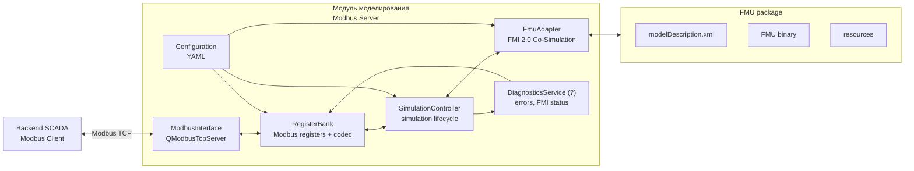
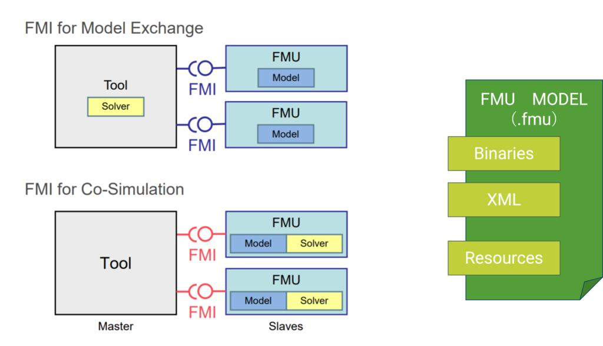

# Архитектура проекта `aris-engine-emulator`

## 1. Назначение документа

Документ описывает архитектуру модуля моделирования стенда обкатки дизельного двигателя.

Модуль моделирования предоставляет ядру SCADA доступ к имитационной модели через Modbus-интерфейс. В рамках Modbus-взаимодействия модуль моделирования выступает в роли сервера, а ядро SCADA — в роли клиента.

Модуль моделирования включает:

- Modbus-сервер;
- контроллер моделирования;
- адаптер FMU/FMI;
- карту Modbus-регистров;
- механизм преобразования Modbus-команд во входы модели;
- механизм преобразования выходов FMU в Modbus-регистры;
- диагностику состояния модели.

## 2. Контекст модуля

Модуль моделирования является частью системы автоматизации процесса обкатки дизельных двигателей (далее — Система).

На уровне всей Системы выделяются следующие крупные части, реализуемые отдельными командами разработки:

1. тестовый модуль моделирования, описываемый в данном документе.
2. backend SCADA;
3. frontend SCADA.

Модуль моделирования не реализует пользовательский интерфейс, хранение истории испытаний и формирование отчётов. Эти функции относятся к backend/frontend-части Системы.

**Основная задача модуля** — предоставлять backend'у SCADA реалистичные моделируемые данные датчиков и принимать управляющие воздействия на моделируемые исполнительные механизмы.

## 3. Границы ответственности

**Модуль моделирования отвечает за:**

- Modbus-серверную часть:
    - запуск Modbus TCP-сервера;
    - приём команд от клиента, то есть backend'а SCADA;
    - хранение актуального состояния Modbus-регистров;
    - обработку записи управляющих регистров;
    - публикацию телеметрии модели через Modbus-регистры;
    - публикацию статуса модели через Modbus-регистры;
    - публикацию диагностических кодов через Modbus-регистры (?);

- контроллер моделирования:
    - преобразование команд Modbus в управляющие воздействия модели;
    - преобразование уставок из Modbus-регистров во входные параметры модели;
    - запуск, управление состояниями и останов моделирования по команде ядра SCADA;
    - синхронизацию цикла обмена между Modbus-регистрами и FMU;

- FMU-runtime / FMI-adapter:
    - загрузку FMU;
    - чтение описания модели из `modelDescription.xml`;
    - загрузку бинарной библиотеки FMU;
    - связывание с FMI-функциями;
    - создание экземпляра FMU;
    - инициализацию FMU через FMI API;
    - установку входных переменных FMU через FMI API;
    - выполнение шага моделирования через FMI API;
    - чтение выходных переменных FMU через FMI API;
    - обработку статусов, возвращаемых FMI API;
    - преобразование FMI-ошибок в диагностические коды модуля;
    - завершение работы FMU и освобождение ресурсов.


## 4. Внешнее взаимодействие с яром SCADA

Взаимодействие между ядром SCADA и модулем моделирования выполняется по протоколу [Modbus](https://ru.wikipedia.org/wiki/Modbus).

Архитектурные роли:

| Участник | Роль Modbus | Ответственность |
|---|---|---|
| Backend SCADA | Client | Читает и записывает регистры модуля моделирования |
| Модуль моделирования | Server | Хранит регистры, принимает команды, публикует телеметрию |

Основные положения:

- Backend SCADA инициирует все операции обмена. 
- Модуль моделирования не выполняет активную отправку данных в ядро SCADA. 
- Передача данных осуществляется через чтение и запись Modbus-регистров.

## 5. Общая архитектура модуля

Основной принцип архитектуры:

- Backend SCADA не знает о FMI.
- Backend SCADA работает только с Modbus-регистрами.
- Модуль моделирования выступает в роли `Modbus TCP Server`.
- Backend SCADA выступает в роли `Modbus TCP Client`.
- FMI-вызовы изолированы внутри `FmuAdapter`.
- Соответствие между Modbus-регистрами и переменными FMU не является прямым; оно выполняется через слой контроллера и маппинга переменных.

Линейная схема:

```text
ModbusClient
    ↓ Modbus TCP
ModbusServer
    ↓
SimulationController
    ↓
FmuAdapter
```

Развёрнутая схема:



Рабочий цикл:

```
QModbusTcpServer принимает запись
    ↓
RegisterBank обновляет значения
    ↓
SimulationController на своём цикле читает RegisterBank
    ↓
SimulationController формирует ModelInputs
    ↓
FmuAdapter преобразует ModelInputs в FMI valueReferences
    ↓
FmuAdapter вызывает fmi2SetReal / fmi2SetInteger / fmi2SetBoolean
    ↓
FmuAdapter вызывает fmi2DoStep
    ↓
FmuAdapter вызывает fmi2GetReal / fmi2GetInteger / fmi2GetBoolean
    ↓
FmuAdapter формирует ModelOutputs
    ↓
SimulationController обновляет RegisterBank
    ↓
Backend SCADA читает Input Registers / Discrete Inputs
```

## 6. Компоненты модуля

### Сводное разделение ответственности

| Компонент | Основная ответственность | Не должен делать |
| --- | --- | --- |
| `ModbusServer` | Modbus TCP-сервер, приём чтения/записи регистров | Выполнять моделирование, вызывать FMI |
| `RegisterBank` | Хранение регистров, codec, snapshot, масштабирование | Управлять FMU, выполнять физику модели |
| `SimulationController` | Жизненный цикл моделирования, команды, состояния, simulation tick | Работать напрямую с Modbus TCP или FMI API |
| `FmuAdapter` | Загрузка FMU, FMI lifecycle, set/get/doStep | Знать о Modbus-регистрах и backend |
| `DiagnosticsService`   | Ошибки, статусы, health flags                                     | Управлять процессом моделирования          |
| `ConfigurationLoader`  | Загрузка YAML-конфигурации                                        | Выполнять runtime-логику модели            |

### 6.1 ModbusServer

Компонент `ModbusServer` отвечает за внешний Modbus TCP-интерфейс модуля моделирования.

`ModbusServer` инкапсулирует работу с Qt Modbus API и не содержит логики моделирования. Его задача — обеспечить транспортный уровень взаимодействия и передать изменения регистров во внутренний слой `RegisterBank`.

| Транспорт | Назначение | Qt-компонент |
|---|---|---|
| [Modbus TCP](https://www.modbus.org/faq#:~:text=What%20is%20Modbus%20TCP/IP%20protocol%3F) | Основной обмен между backend SCADA и модулем моделирования по Ethernet/TCP/IP | [`QModbusTcpServer`](https://doc.qt.io/qt-6/qmodbustcpserver.html) |

#### Классическая модель данных сервера

| Область Modbus      | Размер одного элемента | Доступ со стороны клиента | Типичный смысл                                           |
| ------------------- | ---------------------: | ------------------------- | -------------------------------------------------------- |
| `Coils`             |                  1 бит | Read / Write              | дискретные выходы, команды, флаги управления             |
| `Discrete Inputs`   |                  1 бит | Read Only                 | дискретные входы, статусы, булевые признаки              |
| `Input Registers`   |                 16 бит | Read Only                 | измеряемые значения, телеметрия, состояние               |
| `Holding Registers` |                 16 бит | Read / Write              | уставки, параметры управления, конфигурационные значения |


Эти четыре типа прямо [присутствуют](https://doc.qt.io/qt-6/qmodbusdataunit.html) и в Qt Modbus API.

#### Ответственность

- создание и настройка QModbusTcpServer;
- запуск Modbus TCP-сервера на заданном адресе и порту;
- создание областей данных Modbus;
- обработка Modbus-запросов чтения;
- обработка Modbus-запросов записи;
- передача записанных значений в `RegisterBank`;
- публикация данных из `RegisterBank` во внешние Modbus-регистры;
- обработка ошибок сетевого и протокольного уровня;
- передача диагностической информации из `DiagnosticsService`.

Не должен:

- напрямую вызывать FMI-функции;
- напрямую работать с FMU;
- выполнять шаг моделирования;
- хранить бизнес-логику режимов обкатки;
- принимать технологические решения;
- выполнять проверку физических ограничений модели.

### 6.2 RegisterBank

Компонент `RegisterBank` является внутренним хранилищем Modbus-регистров и основным слоем согласования между Modbus-интерфейсом и контроллером моделирования.

`RegisterBank` отделяет внешний Modbus-протокол от внутренней объектной модели приложения. Благодаря этому `SimulationController` работает не с сырыми Modbus-регистрами, а с типизированными структурами команд, уставок, состояний и телеметрии.

`RegisterBank` содержит:

- значения `Coils`;
- значения `Discrete Inputs`;
- значения `Input Registers`;
- значения `Holding Registers`;
- правила кодирования и декодирования значений;
- правила масштабирования инженерных величин;
- правила преобразования регистров в типизированные структуры;
- механизм безопасного обмена данными между Modbus-потоком и циклом моделирования.

#### Ответственность

- хранение актуальных значений Modbus-регистров;
- декодирование входных значений, записанных backend'ом;
- кодирование выходных значений модели в Modbus-регистры;
- предоставление `SimulationController` типизированного снимка входных данных;
- публикация выходов модели в `Input Registers`;
- публикация статусов модели в `Discrete Inputs`;
- публикация диагностических кодов в регистры состояния (?);
- проверка диапазонов значений;
- применение масштабирования;
- централизованное описание Modbus-контракта.

Не должен:

- запускать или останавливать FMU;
- выполнять `fmi2DoStep`;
- принимать решения о переходе между режимами;
- реализовывать физику модели;
- напрямую взаимодействовать с backend помимо слоя `ModbusServer`.

##### Потокобезопасность

Так как Modbus-запросы и цикл моделирования могут выполняться независимо, `RegisterBank` должен обеспечивать согласованный доступ к данным.

Возможный подход:

- `ModbusServer` записывает значения в `RegisterBank`.
- `SimulationController` читает не отдельные регистры, а атомарный снимок входных данных.
- `SimulationController` публикует результаты моделирования как атомарный снимок выходных данных.
- `ModbusServer` отдаёт backend'у уже опубликованные значения регистров.

Это предотвращает ситуацию, когда часть уставок уже обновлена, а часть ещё содержит старые значения.

#### Структура данных

> TODO

### 6.3 SimulationController

Компонент SimulationController является центральным координатором моделирования.

Он связывает внешний Modbus-контракт с внутренним `FmuAdapter`. `SimulationController` не работает напрямую с `QModbusTcpServer` и не вызывает низкоуровневые FMI-функции напрямую. Для обмена с backend он использует `RegisterBank`, а для работы с FMU — `FmuAdapter`.

#### Ответственность

- чтение команд и уставок из `RegisterBank`;
- преобразование данных из `RegisterBank` во входную структуру `ModelInputs`;
- управление состоянием моделирования:
    - запуск моделирования;
    - останов моделирования;
- сброс модели;
- обработка аварийной остановки;
- передача входных значений в `FmuAdapter`;
- вызов шага моделирования через `FmuAdapter`;
- получение выходных значений из `FmuAdapter`;
- преобразование выходов FMU в структуру `ModelOutputs`;
- публикация телеметрии в `RegisterBank`;
- публикация состояния моделирования в `RegisterBank`;
- публикация диагностической информации в `RegisterBank`;
- контроль частоты шага моделирования;
- контроль переходов между состояниями модели;
- передача ошибок в `DiagnosticsService` (?).

Не должен:

- напрямую обслуживать Modbus TCP-соединения;
- напрямую обращаться к `QModbusTcpServer`;
- хранить карту Modbus-регистров;
- напрямую вызывать `fmi2SetReal`, `fmi2DoStep`, `fmi2GetReal` и другие FMI-функции;
- знать внутреннее устройство FMU;
- выполнять долговременное хранение телеметрии;
- формировать отчёты.

#### Цикл работы

1. Прочитать снимок команд и уставок из `RegisterBank`.
2. Обработать команды.
4. Сформировать `ModelInputs`.
5. Передать `ModelInputs` в `FmuAdapter`.
6. Выполнить шаг моделирования через `FmuAdapter`.
7. Получить `ModelOutputs` из `FmuAdapter`.
9. Опубликовать телеметрию, статусы и диагностику в `RegisterBank`.

#### Структура данных

> TODO Можно добавить и структуру состояний и диаграмму состояний. Тогда надо поправить Цикл работы, добавив упоминание контроля состояния.

### 6.4 FmuAdapter

`FmuAdapter` является внутренним компонентом модуля моделирования. `Backend SCADA` не взаимодействует с ним напрямую и не знает о существовании FMI API.

**FMI (Functional Mock-up Interface)** — это [стандартный интерфейс](https://fmi-standard.org/) для обмена и интеграции динамических моделей. 

**FMU (Functional Mock-up Unit)** — поставляемый пакет модели, который содержит:

| Элемент FMU            | Назначение                                                                        |
| ---------------------- | --------------------------------------------------------------------------------- |
| `modelDescription.xml` | Описание переменных, типов, причинности, начальных значений |
| `binaries`             | Платформенно-зависимая скомпилированная реализация модели                         |
| `resources`            | Дополнительные файлы, необходимые модели во время выполнения                      |

По сути,
FMU — переносимый "чёрный ящик" модели + API для взаимодействия.



#### Ответственность

- распаковка FMU-пакета;
- чтение `modelDescription.xml`;
- загрузка бинарной библиотеки FMU;
- создание экземпляра FMU;
- настройка эксперимента;
- инициализация модели;
- установка входных переменных;
- выполнение шага моделирования;
- чтение выходных переменных;
- обработка FMI-статусов;
- сброс FMU;
- завершение работы FMU;
- освобождение ресурсов.

Не должен:

- знать о Modbus-регистрах;
- знать адреса Modbus-регистров;
- принимать команды напрямую от backend;
- управлять сетевым обменом;
- формировать отчёты;
- выполнять визуализацию;
- хранить историю испытаний.

#### Жизненный цикл FMU

Типовой жизненный цикл FMU в режиме Co-Simulation:

1. Распаковать FMU.
2. Прочитать `modelDescription.xml`.
3. Найти требуемые переменные модели.
4. Загрузить динамическую библиотеку FMU.
5. Создать экземпляр модели.
6. Настроить эксперимент.
7. Войти в initialization mode.
8. Передать начальные значения входов.
9. Выйти из initialization mode.
10. Выполнять циклические шаги моделирования.
11. Завершить работу модели.
12. Освободить ресурсы.

#### Структура данных

##### FMI valueReferences

Внутри FMU переменные идентифицируются не строковыми именами, а числовыми `valueReference`.

Поэтому `FmuAdapter` должен использовать слой маппинга переменных:

```
ModelInputs / ModelOutputs
    ↓
FmuVariableMapper
    ↓
FMI valueReferences
    ↓
fmi2Set* / fmi2Get*
```

> TODO Описать подробнее

### 6.7 DiagnosticsService (?)

> TODO Эта часть не является приоритетной, но по логике должна быть

### 6.8 Configuration

## 7. Потоки выполнения и тайминги

> TODO Диаграмма процесса

## 8. Сценарии обмена

> TODO Указать состояние ключевых структур данных

### 8.1 Запуск моделирования

### 8.2 Остановка моделирования

### 8.3 Холодная обкатка

### 8.4 Запуск и прогрев

### 8.5 Горячая обкатка без нагрузки

### 8.6 Горячая обкатка под нагрузкой

### 8.7 Аварийная остановка

## 9. Обработка ошибок

> TODO Опционально. Не первый приоритет

## 10. Структура исходного кода

> TODO Дерево / деревья с комментариями